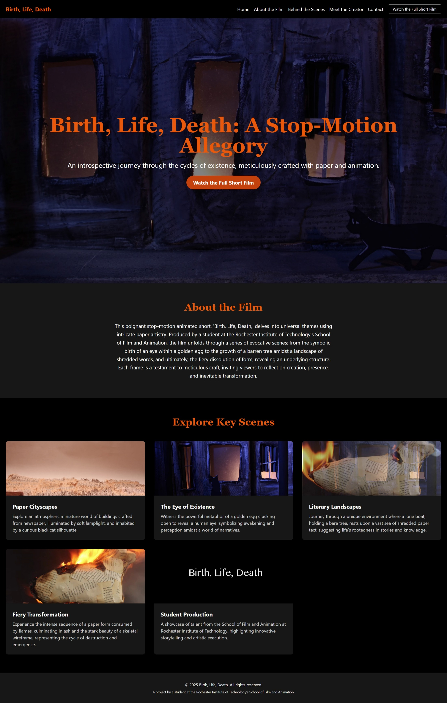

# Gemini Powered Video-to-Website Generator

This project is an autonomous website creation system that transforms video walkthroughs or verbal descriptions into fully-functional, responsive websites. It leverages the power of Google's Gemini 3 multimodal models and the Google Agent Development Kit (ADK) to analyze video, plan architecture, generate code, and iteratively refine the output.

> **Note:** This project was developed as part of the **Google AI Sprint H2, 2025**. We gratefully acknowledge Google for providing the Google Cloud credits that made this development possible.

## Core Capabilities

- **Video Analysis**: Uses Gemini's multimodal reasoning to extract design intent, layout patterns, color schemes, and visual hierarchy from video walkthroughs.
- **Content Extraction**: Identifies text content, information architecture, and navigation structure from verbal descriptions in the video.
- **Code Generation**: Produces production-ready HTML, CSS, and JavaScript implementations. Supports **React** and **Vue** frameworks.
- **Automated Validation**: Employs agents for in-browser validation (using Playwright), accessibility checks, and responsive design verification.
- **Iterative Refinement**: Uses ADK's `LoopAgent` for continuous improvement based on validation feedback.
- **Asset Extraction**: Automatically extracts high-quality images from the video stream to populate the website.

## Gallery

See the tool in action:

|                                                         **Input Video**                                                         | **Generated Website** |
|:-------------------------------------------------------------------------------------------------------------------------------:| :---: |
| <a href="https://www.youtube.com/watch?v=P1wSY4rWKgs" target="_blank"></a> |  |
|                              *[Watch Original Video](https://www.youtube.com/watch?v=P1wSY4rWKgs)*                              | *Generated in < 2 minutes* |

## Use Cases

This tool is designed to dramatically accelerate the "idea-to-code" and "content-to-web" workflows.

### 1. Automated Content Repurposing (For Creators)
- **Who:** YouTubers, course creators, and content marketers.
- **Problem:** Valuable information is "trapped" inside videos, making it hard to search, skim, or reference.
- **Solution:** Automatically convert a video tutorial or a playlist into a well-structured blog post or a navigable course website. The system transcribes the content, extracts key topics as sections, and generates a content-rich, SEO-friendly webpage.

### 2. High-Fidelity Prototyping (For Designers)
- **Who:** UI/UX Designers.
- **Problem:** Static mockups fail to convey the true feel of a website's animations and responsive behavior.
- **Solution:** A designer records a video walkthrough of their Figma or Sketch prototype. The tool generates a live, interactive HTML/CSS/JS prototype that behaves like a real website, perfect for client feedback and developer handoff.

### 3. Rapid Landing Page Generation (For Entrepreneurs)
- **Who:** Marketers, entrepreneurs, and startups.
- **Problem:** Need a web presence for a new product or campaign immediately, without waiting for developers.
- **Solution:** Sketch a layout on a whiteboard or verbally describe the desired structure while recording. The tool generates a v1 landing page in minutes, ready for idea validation and email sign-ups.

### 4. Developer Scaffolding & Boilerplate
- **Who:** Frontend and Full-Stack Developers.
- **Problem:** The initial project setup—structuring HTML, extracting design tokens (colors, fonts), and writing boilerplate CSS—is tedious.
- **Solution:** Run a video of the final design through the tool to instantly get a complete project scaffold with semantic HTML, a CSS file with variables, and basic layout styles already implemented.

## Tech Stack

- **AI & Orchestration**:
  - **Google Agent Development Kit (ADK)**: For agent orchestration (`SequentialAgent`, `ParallelAgent`, `LoopAgent`).
  - **Google Gemini 3 Flash/Pro**: Multimodal LLM for video understanding and code generation.
- **Development Environment**:
  - **Python 3.11+**
  - **uv**: For fast dependency management.
  - **pip**: For package installation.
- **Core Libraries**:
  - `google-genai`: The official Google Gemini SDK.
  - `playwright`: For browser automation and validation.
  - `yt-dlp`: For downloading YouTube videos for analysis.
  - `dirtyjson`: For robust parsing of LLM-generated JSON.
  - `python-dotenv`: For managing environment variables.
  - `streamlit`: For the interactive user interface.

## Project Structure

```
video-to-website-generator/
├── src/
│   └── video_to_website/
│       ├── agent.py             # Root agent and App definition
│       ├── agents/              # Individual agent implementations
│       ├── tools/               # Custom tool functions
│       ├── prompts/             # LLM instruction templates
│       ├── schemas/             # Pydantic models for structured data
│       ├── plugins/             # Custom ADK plugins (e.g., ModelFallback)
│       └── ui/                  # Streamlit application
├── tests/
│   ├── unit/
│   └── integration/
├── examples/
│   └── basic_usage.py       # Runnable example to generate a website
├── output/                      # Generated website output (gitignored)
├── Dockerfile                   # Container definition for deployment
└── .gitignore                   # Files to ignore in version control
```

## Setup Instructions

### 1. Clone the Repository

```bash
git clone <your-repo-url>
cd video-to-website-generator
```

### 2. Create a Virtual Environment

It is highly recommended to use a virtual environment.

```bash
# Create a virtual environment
python -m venv .venv

# Activate it
# On Windows
.venv\Scripts\activate
# On macOS/Linux
source .venv/bin/activate
```

### 3. Install Dependencies

Install all required packages from `pyproject.toml`.

```bash
pip install -e .[dev]
```
*(Note: The `-e .` installs the project in editable mode, and `[dev]` installs the development dependencies like pytest).*

You will also need to install the browser binaries for Playwright:
```bash
playwright install
```

### 4. Set Up Your API Key

The application requires a Google Gemini API key.

1.  Create a file named `.env` in the root of the project.
2.  Add your API key to the file:

    ```
    GOOGLE_API_KEY="your-api-key-here"
    ```

## How to Run

### Run the UI (Recommended)

Launch the interactive Streamlit application:

**On Windows (Command Prompt):**
```cmd
set PYTHONPATH=src && python -m streamlit run src/video_to_website/ui/streamlit_app.py
```

**On macOS/Linux:**
```bash
export PYTHONPATH=src && python -m streamlit run src/video_to_website/ui/streamlit_app.py
```

### Run via CLI

To run the pipeline without the UI:

```bash
python examples/basic_usage.py
```

### Run Tests

To verify that all components are working correctly, run the test suite:

```bash
pytest
```

## Troubleshooting

### Playwright Issues on Windows
If you encounter `NotImplementedError` related to asyncio loops:
- Ensure you are running the app with `python -m streamlit run ...`.
- The application automatically sets the `WindowsProactorEventLoopPolicy` to fix this.

### "ModuleNotFoundError"
- Ensure your virtual environment is activated.
- Ensure `PYTHONPATH` is set to `src` if running scripts directly.

### Quota Errors (429)
- The application includes a `ModelFallbackPlugin` that automatically switches to lower-tier models (Gemini 2.5 Flash -> 2.0 Flash) if the primary model hits a quota limit.
- It also includes a `StaggerPlugin` to prevent parallel agents from hitting the API simultaneously.
